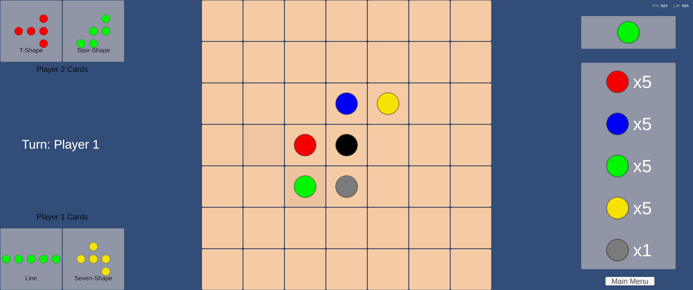

# Logix Game

> Unity implementation of the Logix board game featuring human and AI players.

---

## Overview

This project contains the Unity implementation of the board game **Logix** developed as part of a bachelor's thesis. It provides a graphical interface for playing the game, supports multiple game modes, and integrates several artificial intelligence agents developed during the project.

The application can be used to play against another human player, compete against computer-controlled opponents of varying difficulty, or observe matches between AI agents. Neural-network-based agents trained using the accompanying Python framework can also be integrated into the game through exported ONNX models.

## Screenshots

### Main Menu


### Gameplay



## Features

- Complete implementation of the Logix board game
- Interactive graphical user interface built with Unity
- Human vs Human mode
- Human vs AI mode
- AI vs AI mode
- Multiple AI opponents with different strategies
- Integration of ONNX neural network models
- Visual representation of player objectives and game state

## Project Structure

```
LogixGame/
│
├── Assets/                 # Game assets, scripts, scenes, UI, and resources
│   ├── Prefabs/            # Reusable game objects
│   ├── Scenes/             # Unity scenes
│   ├── Scripts/            # Game logic and AI integration
│   ├── Settings/           # Project-specific assets and settings
│   └── Tests/              # Unit and play mode tests
│
├── Packages/               # Unity package dependencies
├── ProjectSettings/        # Unity project configuration
├── LogixGame.sln           # Visual Studio solution
└── README.md
```

### Main Components

| Component | Description |
|-----------|-------------|
| `Assets/` | Contains the complete game implementation, including scripts, scenes, prefabs, user interface, and visual assets. |
| `Assets/Scripts/` | Implements the game logic, player interaction, AI behaviour, and game management. |
| `Assets/Scenes/` | Contains the playable Unity scenes, including the main menu and gameplay scene. |
| `Assets/Prefabs/` | Stores reusable game objects such as game pieces, UI elements, and other scene components. |
| `Assets/Tests/` | Unit and play mode tests used to verify selected parts of the implementation. |
| `Packages/` | Unity package manifest and package dependencies. |
| `ProjectSettings/` | Unity project configuration, rendering, input, physics, and editor settings. |

## Requirements

The project was developed using Unity.

To open and modify the project, install the recommended Unity Editor version and open the `LogixGame` folder using Unity Hub.

No additional plugins are required beyond the packages included with the project.

## Opening the Project

The project was developed using **Unity 6**.

To open the project:

1. Install the appropriate version of the Unity Editor using **Unity Hub**.
2. Open Unity Hub and select **Add Project**.
3. Choose the `LogixGame` directory.
4. Allow Unity to import all required assets and packages.
5. Open the main gameplay or menu scene located in `Assets/Scenes/`.

After the initial import, the project is ready to run directly from the Unity Editor.

## Gameplay

The application implements the complete rules of the board game **Logix** through an interactive graphical interface.

The following game modes are available:

- **Human vs Human** – two players compete on the same device.
- **Human vs AI** – a player competes against one of the implemented computer-controlled opponents.
- **AI vs AI** – two selected agents play automatically, allowing their behaviour to be observed and compared.

The interface displays the current game board, player objectives, available actions, and game status throughout the match. Additional menus provide access to the game rules and project information.

## AI Opponents

The Unity application integrates several AI agents developed as part of the project.

Available opponents include:

- **Random Bot** – selects legal moves uniformly at random.
- **Heuristic Bot** – evaluates moves using a handcrafted heuristic function.
- **Alpha-Beta Bot** – performs game-tree search with alpha-beta pruning.
- **Monte Carlo Tree Search (MCTS) Bot** – selects moves using Monte Carlo Tree Search.

The application also supports neural-network-assisted agents through models trained in the accompanying **EvaluationFunction** project and exported in the ONNX format.

## Building the Project

The project can be built using Unity's standard build pipeline.

To create a standalone application:

1. Open **File → Build Profiles**.
2. Select the desired target platform.
3. Add the required scenes to the build configuration if necessary.
4. Choose an output directory.
5. Click **Build** or **Build and Run**.

The generated executable can be distributed independently without requiring the Unity Editor.

## Documentation

Detailed technical documentation is available in the repository-level [`docs/logix-game/`](../docs/logix-game/) directory.

- [Overview](../docs/logix-game/overview.md)  
  High-level description of the Unity application, project architecture, gameplay features, and interaction with other repository components.

- [Architecture](../docs/logix-game/architecture.md)  
  Internal organization of the Unity project, including the GameManager, GameBoard, AI controllers, UI system, and scene structure.

- [Game Flow](../docs/logix-game/game-flow.md)  
  Complete match lifecycle, turn handling, supported game modes, game-state updates, and win detection.

- [AI Integration](../docs/logix-game/ai-integration.md)  
  Integration of AI opponents, bot interfaces, difficulty levels, ONNX model deployment, and interaction with the game logic.

- [UI System](../docs/logix-game/ui-system.md)  
  User interface architecture, board visualization, inventory, objective cards, menus, and player interaction.

The complete rules of Logix are described in the [Game Rules](../docs/game-rules.md).

## Related Components

This Unity project is one part of the complete Logix project, which also includes:

- **EvaluationFunction** – a Python framework for training neural-network-based evaluation functions through self-play.
- **BotExperiments** – an automated benchmarking framework for evaluating and comparing different AI agents.
- **LogixGame** *(this project)* – the Unity implementation of the Logix board game with support for human and AI players.
- **BachelorsThesis** – the accompanying thesis documenting the design, implementation, training process, and experimental evaluation of the project.

Together, these components provide a complete workflow covering game implementation, AI development, experimental evaluation, and documentation.